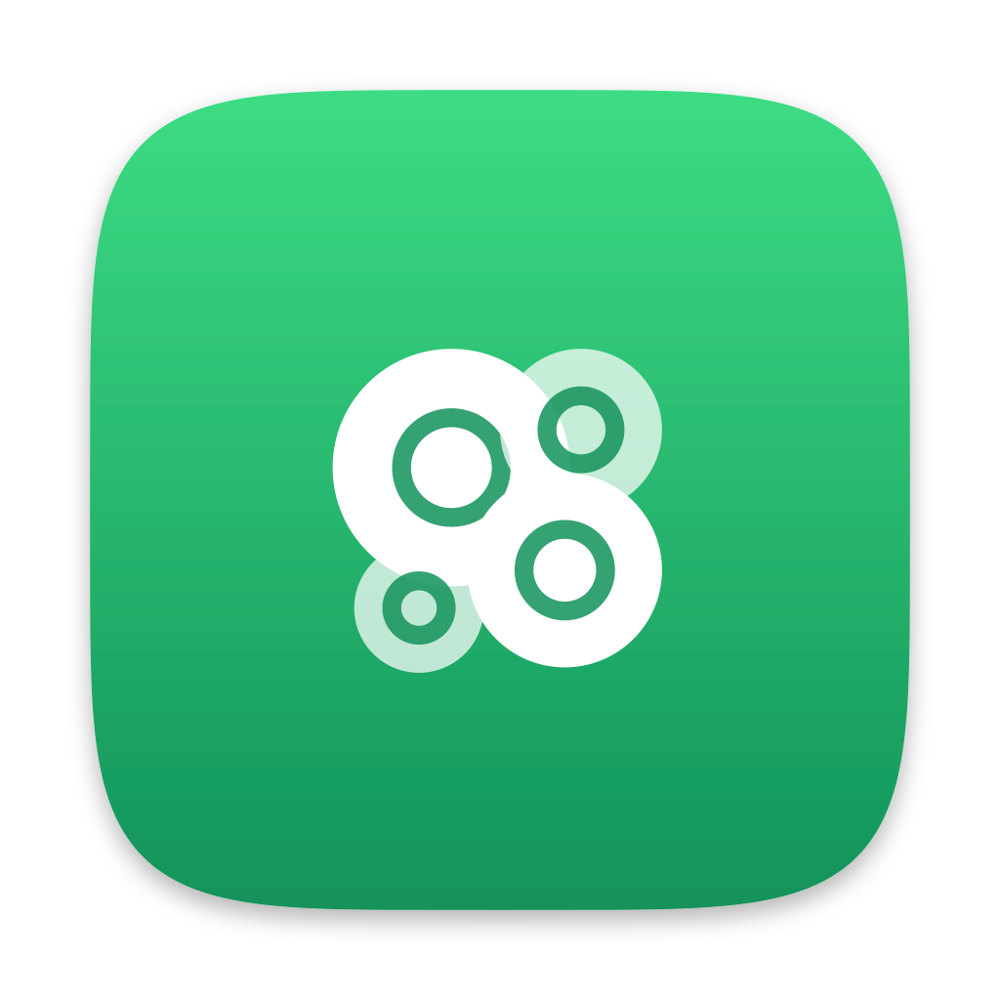

# lichen

A project for easily keeping macOS dev environments in sync.

It syncs things, one module per kind of thing:

- **files**: dotfiles, slash commands, `CLAUDE.md`, app configs, anything
  under your home directory. Your own skills and slash commands are just
  files and directories, so they sync like everything else.
- **skills**: agent skills installed from public repos, kept up to date
  by polling.
- **mcp**: MCP servers, installed into Claude Code and Codex.

lichen is a pun on 'liken' and just how lichen behaves in general.

## Setup

Prereqs on each machine: [Homebrew](https://brew.sh) (installs chezmoi),
and git access that can clone the sync repo (SSH key or credentials,
since the repo should be private).

Create an empty private repo once (the sync repo, e.g. `you/lichen-sync`),
then on every machine:

```sh
curl -fsSL https://raw.githubusercontent.com/dittofleet/lichen/HEAD/install.sh | sh
```

Then start syncing things:

```sh
lichen sync ~/.zshrc ~/.claude/CLAUDE.md
```

Deletions sync too: delete a synced file on one machine and every other
machine deletes its copy. A file deleted by mistake can be brought back
from the sync repo's git history, on all machines at once:

```sh
lichen sync recover ~/.zshrc
```

### Backups

Off by default. When a machine already has its own version of a file
that starts syncing (a fresh machine joining, or a path first synced
from another machine), the synced version replaces it and the local one
is gone. A directory in the way is the exception: it may hold files
that were never synced, so it is always moved to `~/lichen-backups/`.
To keep replaced and deleted files there as well, set `backups` in
`~/.config/lichen/config.json` (it syncs, so this turns backups on for
every machine):

```json
{ "topic_prefix": "...", "backups": true }
```

## Skills

The skills module installs agent skills (`SKILL.md` directories, the
format the [Vercel skills CLI](https://github.com/vercel-labs/skills)
uses) from public repos:

```sh
lichen skills add vercel-labs/agent-skills --skill frontend-design
lichen skills add owner/single-skill-repo
```

The canonical copy lands in `~/.agents/skills/<name>` with a relative
symlink from `~/.claude/skills/<name>`, the same layout `npx skills`
creates, so Claude Code picks the skill up globally and both tools
coexist: lichen never touches a skill it didn't install. Other harnesses
get links too by listing their skill directories in the skills config:

```json
{ "harnesses": ["~/.claude/skills", "~/.codex/skills"] }
```

A skill can limit itself to some harnesses with a comma-separated
`lichen-harnesses` under `metadata` in its `SKILL.md` frontmatter. A
harness is named after the directory holding its skills dir, so
`~/.claude/skills` is `claude` and `~/.codex/skills` is `codex`:

```yaml
---
name: my-skill
description: ...
metadata:
  lichen-harnesses: claude, codex
---
```

Some harnesses (Codex among them) read `~/.agents/skills` directly, so a
limited skill's canonical copy lives in `~/.local/share/lichen/skills`
instead, reachable only through the listed harnesses' links. List
`agents` to keep it in `~/.agents/skills`.

The list of skill repos lives in its own synced config file
(`~/.config/lichen/skills.json`), so adding a skill on one machine
installs it everywhere, and removing one uninstalls it everywhere. The
daemon polls each repo about hourly, and a repo moving only reinstalls
the skills whose content actually changed. `lichen skills update` checks
immediately.

## MCP servers

The mcp module installs MCP servers into Claude Code and Codex, from a
command to launch or a URL to reach:

```sh
lichen mcp add playwright bunx @playwright/mcp@latest
lichen mcp add context7 https://mcp.context7.com/mcp
lichen mcp remove context7
lichen mcp list
```

Servers go in at user scope through each harness's own CLI (`claude mcp`
and `codex mcp`), and a harness that isn't installed on a machine is
skipped. lichen never touches a server it didn't add, so a name you
already use in a harness is left alone there. Running sessions pick up
changes after a restart.

The list of servers lives in its own synced config file
(`~/.config/lichen/mcp.json`), so adding a server on one machine
installs it everywhere, and removing one uninstalls it everywhere.
Servers that need API keys, headers or a login aren't supported.

## Updates

`lichen update` installs the latest release. The sync repo records the
newest lichen version that has synced with it, and a machine running an
older build pauses syncing and updates itself automatically, so
updating one machine brings the whole fleet along.
